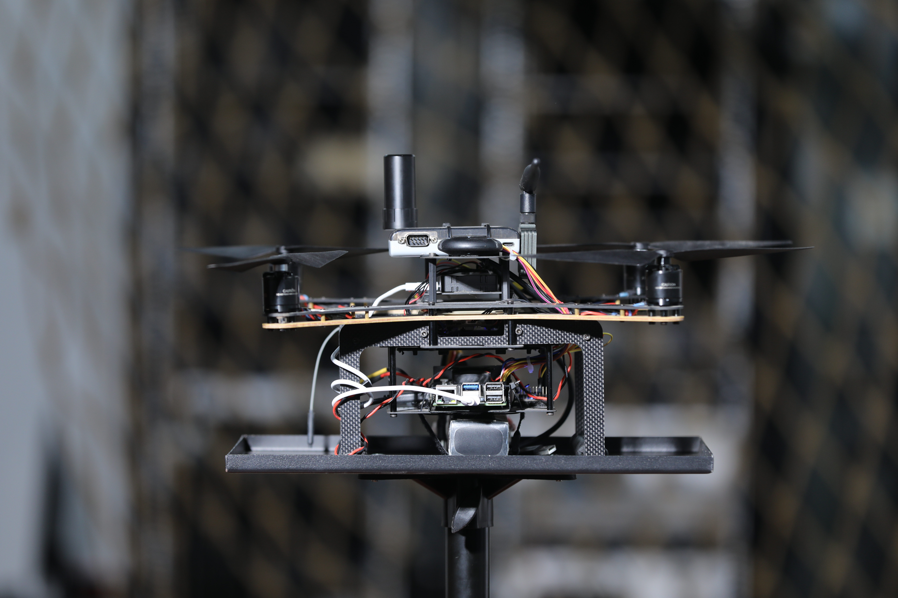
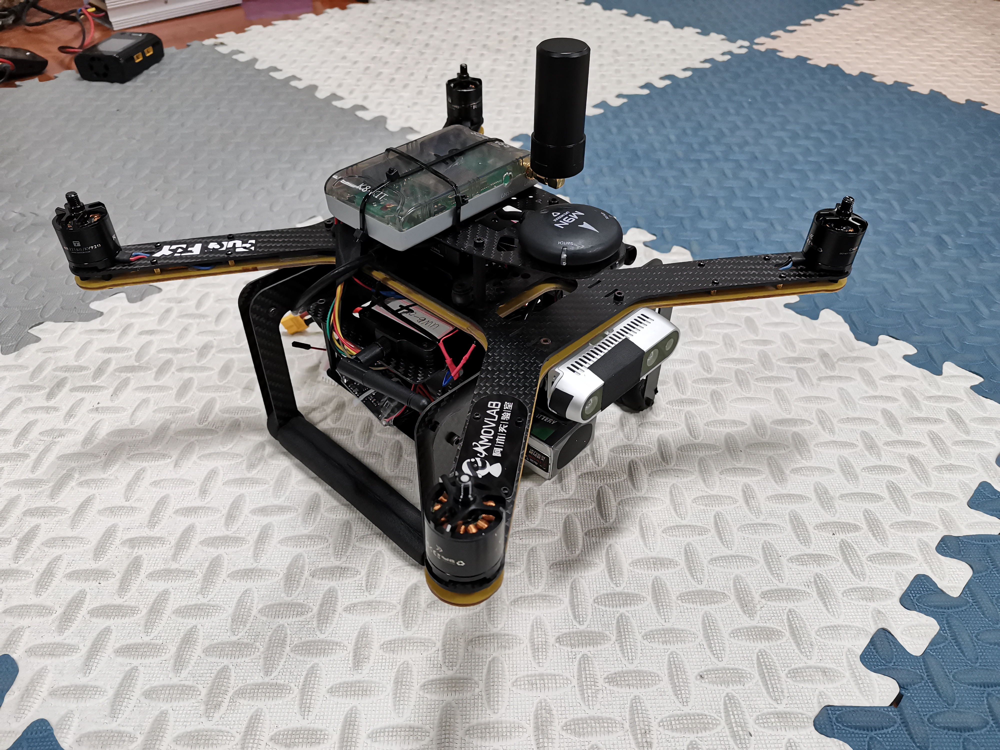

### 关于无人机的一些图片和视频

#### 1. 无人机各视角图片

#### 2. 无人机编队飞行视频

**1. 空地协同演示 (Air-Ground Coordination)**
<video src="https://github.com/zzh-oops/zzh-oops.github.io/releases/download/assets/air_ground_coordination.mp4" controls="controls" width="100%" style="margin-bottom: 30px; border-radius: 5px; box-shadow: 0 5px 15px rgba(0,0,0,0.1);"></video>

**2. 降落测试 (Landing)**
<video src="https://github.com/zzh-oops/zzh-oops.github.io/releases/download/assets/landing.mp4" controls="controls" width="100%" style="margin-bottom: 30px; border-radius: 5px; box-shadow: 0 5px 15px rgba(0,0,0,0.1);"></video>

**3. 平飞测试 (Level Flight)**
<video src="https://github.com/zzh-oops/zzh-oops.github.io/releases/download/assets/level_flight.mp4" controls="controls" width="100%" style="margin-bottom: 30px; border-radius: 5px; box-shadow: 0 5px 15px rgba(0,0,0,0.1);"></video>

**4. 实时轨迹规划 (Realtime Planning)**
<video src="https://github.com/zzh-oops/zzh-oops.github.io/releases/download/assets/realtime_planning.mp4" controls="controls" width="100%" style="margin-bottom: 30px; border-radius: 5px; box-shadow: 0 5px 15px rgba(0,0,0,0.1);"></video>